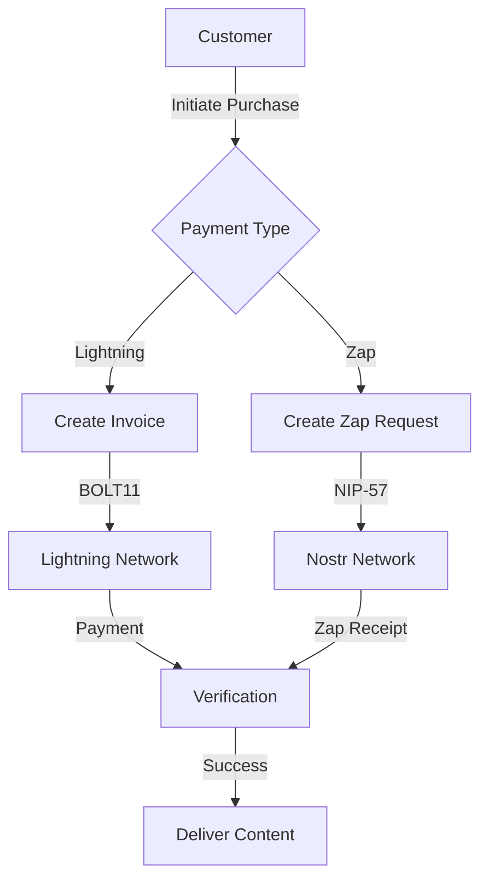

# Commerce Integration Guide

This guide explains how to integrate commerce features into your Nostr application using the Nostr Commerce Framework.

## Overview

The framework supports two primary payment methods:
1. Lightning Network Payments
2. Nostr Zaps (NIP-57)

## Payment Flow



## Basic Setup

```typescript
import { NostrCommerce } from 'nostr-commerce-framework';

const framework = new NostrCommerce({
  relays: ['wss://relay.primal.net'],
  publicKey: 'your-public-key',
  privateKey: 'your-private-key',
  lud16: 'your-lightning-address@getalby.com'  // For Zap support
});

await framework.start();
```

## Lightning Network Payments

### Creating Invoices

```typescript
const invoice = await framework.commerce.createInvoice({
  amount: 1000,  // Amount in sats
  description: 'Product purchase',
  expiry: 3600,  // Optional: expire in 1 hour
  metadata: {    // Optional: custom metadata
    orderId: '12345',
    productId: 'xyz'
  }
});
```

### Verifying Payments

```typescript
const isPaid = await framework.commerce.verifyPayment(invoiceId);
if (isPaid) {
  // Deliver product
}
```

## Nostr Zaps

### Setting Up Zap Support

1. Configure Lightning Address:
```typescript
const framework = new NostrCommerce({
  // ... other config
  lud16: 'your-lightning-address@getalby.com'
});
```

2. Listen for Zap events:
```typescript
framework.commerce.on('paymentReceived', (payment) => {
  if (payment.type === 'zap') {
    const { amount, senderPubkey, zapEventId } = payment;
    // Handle Zap payment
  }
});
```

### Processing Zaps

```typescript
// Create a Zap request
const zapRequest = await framework.commerce.processZap({
  recipient: 'seller-pubkey',
  amount: 1000,
  comment: 'Product purchase',
  eventId: 'original-event-id',  // Optional
  tags: [                        // Optional
    ['product', 'xyz'],
    ['order', '12345']
  ]
});
```

### Verifying Zaps

```typescript
const isZapReceived = await framework.commerce.verifyPayment(
  zapEventId,
  'zap'
);
```

## Event Handling

### Payment Events

```typescript
// Listen for all payments
framework.commerce.on('paymentReceived', (payment) => {
  console.log('Payment type:', payment.type);
  console.log('Amount:', payment.amount);
  
  if (payment.type === 'zap') {
    console.log('Zap event:', payment.zapEventId);
  } else {
    console.log('Invoice:', payment.invoiceId);
  }
});

// Listen for expired payments
framework.commerce.on('paymentExpired', (payment) => {
  console.log('Expired payment:', payment);
});
```

### Custom Events

```typescript
// Subscribe to specific events
framework.subscribe(
  [{ kinds: [30020, 30021] }],  // Custom commerce events
  (event) => {
    // Handle commerce events
  }
);
```

## Error Handling

```typescript
try {
  await framework.commerce.createInvoice({
    amount: 1000,
    description: 'Test'
  });
} catch (error) {
  if (error instanceof NostrError) {
    switch (error.code) {
      case ErrorCode.INVALID_AMOUNT:
        // Handle invalid amount
        break;
      case ErrorCode.PAYMENT_FAILED:
        // Handle payment failure
        break;
      case ErrorCode.ZAP_FAILED:
        // Handle Zap failure
        break;
    }
  }
}
```

## Security Considerations

1. **Payment Verification**
   - Always verify payments before delivering content
   - Check both Lightning Network and Zap receipts
   - Validate payment amounts match expected values

2. **Nostr Events**
   - Verify event signatures
   - Check event kinds match expected types
   - Validate payment proofs

3. **Content Protection**
   - Use preview/watermarked content before payment
   - Secure delivery mechanisms after payment
   - Implement proper access controls

## Best Practices

1. **Payment Handling**
   ```typescript
   // Support both payment methods
   const paymentOptions = {
     lightning: {
       invoice: 'bolt11...',
       expires: 3600
     },
     zap: {
       address: 'user@getalby.com',
       pubkey: 'seller-pubkey'
     }
   };
   ```

2. **Event Management**
   ```typescript
   // Clean up subscriptions
   const unsubscribe = framework.subscribe(filters, callback);
   // Later...
   unsubscribe();
   ```

3. **Error Recovery**
   ```typescript
   // Implement retry logic
   const maxRetries = 3;
   let attempts = 0;
   
   while (attempts < maxRetries) {
     try {
       await framework.commerce.verifyPayment(paymentId);
       break;
     } catch (error) {
       attempts++;
       await new Promise(r => setTimeout(r, 1000));
     }
   }
   ```

## Examples

See the [examples directory](https://github.com/stevengeller/nostr-commerce-framework/tree/main/examples) for complete implementations:

- Image Store with Zap support
- Digital downloads platform
- Content monetization system
- Subscription service